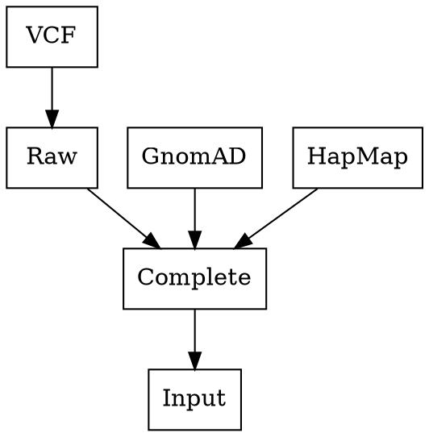
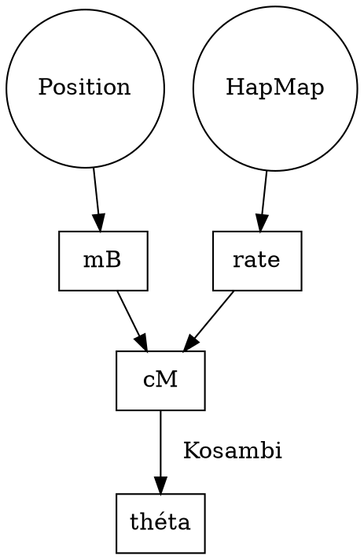

# Estiage

###### tags `estiage`

## Pipeline

* get marker positions from raw file
* get frequencies from gnomAD (and position)
* get mutation rate from hapmap file (and position)

## Formats 2021-12-03

### Human fed Input Format [.estiraw]

| . |Left6 |Left5 |Left4 |Left3 |Left2 |Left1 |Target |Right1 |Right2 |Right3 |Right4 |Right5 |Right6 |
| ---|---|---|---|---|---|---|---|---|---|---|---|---|---|
| Samples\Markers |D21S 85 |D12S 1701 |D12S 368 |D12S 96 |D12S 359 |D12S 1604 |AAAS |D12S 1586 |D12S 1707 |D12S 1691 |D12S 90 |D12S 83 |D12S 1702 |
| P1 |1 |2 |1 |1 |1 |5 | |3 |1 |1 | | | |
| P2 |5 |2 |1 |1 |1 |5 | |3 |1 |6 |2 |1 |2 |
| P3 |4 |2 |1 |1 |1 |5 | |3 |1 |3 | | | |
| P4 | |1 |1 |1 |1 |5 | |3 |4 | | | | |
| P5 | | |2 |1 |1 |5 | |3 |2 | | | | |
| P6 | | |4 |1 |1 |5 | |3 |1 |6 |2 |1 |3 |
| P7 | | |2 |1 |1 |5 | |3 |1 |4 | | | |
| P8 | | | |3 |1 |5 | |3 |2 | | | | |
| P9 | | | |2 |1 |5 | |3 |3 | | | | |
| Positions |chr7:654301 |chr7:654302 |chr7:654303 |chr7:654304 |chr7:654305 |chr7:654306 |chr7:654307 |chr7:654308 |chr7:654309 |chr7:654310 |chr7:654311 |chr7:654312 |chr7:654313 |

### Complete Input Format [.estifull]

| . |Left6 |Left5 |Left4 |Left3 |Left2 |Left1 |Target |Right1 |Right2 |Right3 |Right4 |Right5 |Right6 |
| ---|---|---|---|---|---|---|---|---|---|---|---|---|---|
| Samples\Markers |D21S 85 |D12S 1701 |D12S 368 |D12S 96 |D12S 359 |D12S 1604 |AAAS |D12S 1586 |D12S 1707 |D12S 1691 |D12S 90 |D12S 83 |D12S 1702 |
| P1 |1 |2 |1 |1 |1 |5 | |3 |1 |1 | | | |
| P2 |5 |2 |1 |1 |1 |5 | |3 |1 |6 |2 |1 |2 |
| P3 |4 |2 |1 |1 |1 |5 | |3 |1 |3 | | | |
| P4 | |1 |1 |1 |1 |5 | |3 |4 | | | | |
| P5 | | |2 |1 |1 |5 | |3 |2 | | | | |
| P6 | | |4 |1 |1 |5 | |3 |1 |6 |2 |1 |3 |
| P7 | | |2 |1 |1 |5 | |3 |1 |4 | | | |
| P8 | | | |3 |1 |5 | |3 |2 | | | | |
| P9 | | | |2 |1 |5 | |3 |3 | | | | |
|Position|chr7:654301|chr7:654302|chr7:654303|chr7:654304|chr7:654305|chr7:654306|chr7:654307|chr7:654308|chr7:654309|chr7:654310|chr7:654311|chr7:654312|chr7:654313|
|Ancestral|-1|2|1|1|1|5||3|1|6|2|1|-1|
mb|0.654301|0.654302|0.654303|0.654304|0.654305|0.654306|0.654307|0.654308|0.654309|0.65431|0.654311|0.654312|0.654313|
|Distance|5.999999999950489E-6|4.999999999921734E-6|4.000000000004E-6|2.9999999999752447E-6|1.999999999946489E-6|9.999999999177334E-7||1.0000000000287557E-6|2.0000000000575113E-6|2.9999999999752447E-6|4.000000000004E-6|5.000000000032756E-6|6.000000000061512E-6|
|Mean rate|1.140275255923735|1.1402748706621608|1.1402744891592362|1.1402741142339483|1.1402737524639333|1.1402734235821017||1.1402726342657057|1.1402721738311412|1.14027174628476|1.1402713318936522|1.1402709240801807|1.1402705200253591|
|cM|6.841651535485955E-6|5.701374353221559E-6|4.561097956641506E-6|3.4208223426736172E-6|2.2805475048668493E-6|1.1402734234882952E-6||1.140272634298495E-6|2.280544347727861E-6|3.4208152388260523E-6|4.56108532757917E-6|5.701354620438254E-6|6.841623120222294E-6|
|θ Recombination Fraction|6.841651536169551E-8|5.701374355326747E-8|4.561097955141772E-8|3.420822341165846E-8|2.280547502296855E-8|1.1402734218815607E-8||1.1402726336232494E-8|2.2805443492637526E-8|3.420815241290576E-8|4.5610853263571705E-8|5.7013546211169844E-8|6.841623120019011E-8|
|Freq|0.0|0.0|0.0|0.0|0.0|0.0||0.0|0.0|0.0|0.0|0.0|0.0|

### Estiage input Format [.estinput]

| line | meaning |
|---|---|
| 9 6 6 | $N_{samples}$ $N_{Left}$ $N_{Right}$ |
| 0.0001 0.0002 0.007 0.0108 0.0466 0.0508 | $\theta_{Left}$ |
| 0.22 0.27 0.02 0.01 0.42 | $Freq_{Left}$ |
| 0.0026 0.0084 0.0271 0.0339 0.0516 0.1032 | $\theta_{Right}$ |
| 0.19 0.46 0.21 0.07 0.04 | $Freq_{Right}$ |
| 0.001 0 | MeanMutationRate MutationModel |
| 5 1 1 1 2 -1 | $Ancestral_{Left}$ |
| 3 1 6 2 1 -1  | $Ancestral_{Right}$ |
| 6 3 1 1 | $S_1(L_p R_p L_v R_v)$ |
| 6 6 5 2 | $S_2(L_p R_p L_v R_v)$ |
| 6 3 4 3 | $S_3(L_p R_p L_v R_v)$ |
| 5 2 1 4 | $S_4(L_p R_p L_v R_v)$ |
| 4 2 2 2 | $S_5(L_p R_p L_v R_v)$ |
| 4 6 4 3 | $S_6(L_p R_p L_v R_v)$ |
| 4 3 2 4 | $S_7(L_p R_p L_v R_v)$ |
| 3 2 3 2 | $S_8(L_p R_p L_v R_v)$ |
| 3 2 2 3 | $S_9(L_p R_p L_v R_v)$ |

with
- $L_p$: 1-based Position of the first Left Marker with an allele different from the ancestral allele
- $R_p$: 1-based Position of the first Right Marker with an allele different from the ancestral allele
- $L_v$: Allele value at $L_p$
- $R_v$: Allele value at $R_p$

MutationModel
- [0/1] Step wise mutation ? 0:false 1:true

### Results

RESULTS
Output results are printed on one line:
- `n` is the estimated number of generations
- `nend` is the total number of iterations performed
- `ninf` is the lower bound of the 95% CI
- `nsup` is the upper bound of the 95% CI
- `likelihood` is the corresponding likelihood

For example on the file `dataAAA.in`: the output will be

`n = 47, nend = 128, ninf = 28, nsup = 80, likelihood = -26.412115`

meaning that the estimated number of generations is 47 with a 95% CI of [28, 80]

## Flowchart

## Recombination Fraction

For each marker
- get the position in mB
- get the distance in mB between the marker and the target
- get the mean recombination rate between the marker and the target
- compute the distance in cM
- compute theta

https://vc.popgen.org/articles/Kosambi.pdf

:::danger
Formula is wrong here !!!
https://www.ias.ac.in/public/Volumes/reso/016/06/0540-0550.pdf page 9
:::

distance $= abs(mB_{marker} - mB_{target})$

cM $=$ rate $\times$ distance

$d =$ cM $/100$

$r = \frac{e^{4d} - 1}{2(e^{4d} + 1)}$

REFERENCE

E. Genin, A. Tullio-Pelet, F. Begeot, S. Lyonnet, and L. Abel (2004). Estimating the age of rare disease mutations: the example of Triple-A syndrome J Med Genet 41: 445-449